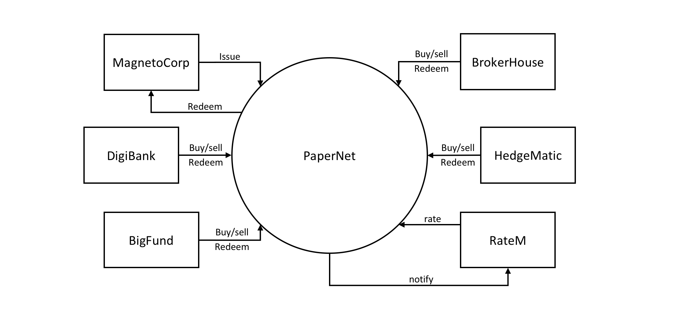

# Extending the Commercial Paper Network

https://blog.daemonl.com/2016/02/yaml.html

## An In-Depth Look on onfigtx.yaml

# Fabric Application Examples

A test and demo repo showing how the programming model works. Code is AS-IS, and may change.

This code will be folded into the Hyperledger Fabric docs at some point.

[Main notes on running the Commercial Paper example](./docs/Running-Commercial-Paper-Contract.md)

## Repo structure

- docs
  - Documentation - in markdown format
- application
  - nodejs - a nodejs application showing connecting to the fabric issue transactions on the smart contract
- contracts
  - papernet-js  - a contract written using javascript
- infrastructure
  - the configuration to bring up the fabric infrastructure required.

The hope would be to add matching/equivalent contracts and applications in the other languages (Golang, Java, Typescript .net)
